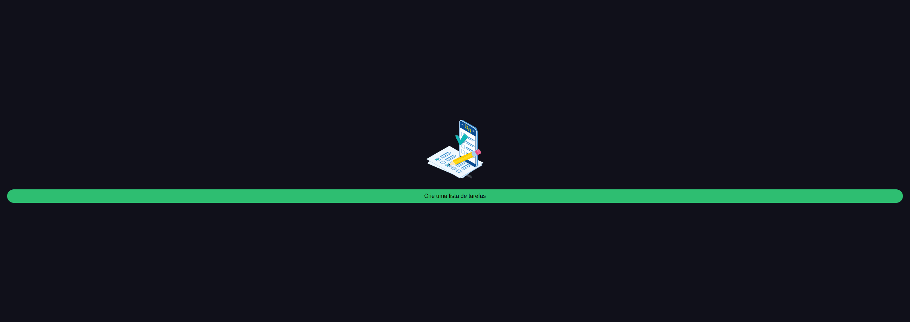

# Gerenciador de tarefas




## Sobre o projeto

Esta aplicação demonstra as melhores práticas no desenvolvimento em Angular enquanto oferece uma interface limpa e intuitiva para gerenciar tarefas diárias.

## Funcionalidades

- **Gerenciamento de Tarefas** - Crie, edite e exclua tarefas com facilidade
- **Acompanhamento de Status** - Marque tarefas como concluídas/incompletas com separação visual
- **Persistência de Dados** - Tarefas são automaticamente salvas no armazenamento local
- **Design Responsivo** - Funciona perfeitamente em dispositivos móveis e desktop
- **Diálogos de Confirmação** - Previne exclusão acidental de tarefas

## Destaques Técnicos

- Construído com **Angular 18** usando componentes standalone
- Gerenciamento de estado com a **API de Signals** do Angular
- Integração com **Local Storage** para persistência de dados
- Arquitetura modular com clara separação de responsabilidades
- Estilização responsiva com **SCSS**
- Confirmações interativas com **SweetAlert2**

## Como Executar o Projeto

1. Clone o repositório
2. Instale as dependências:
    ```bash
    npm install
    ```
3. Execute o servidor de desenvolvimento:
    ```bash
    npm start
    ```
4. Abra seu navegador em `http://localhost:4200`
